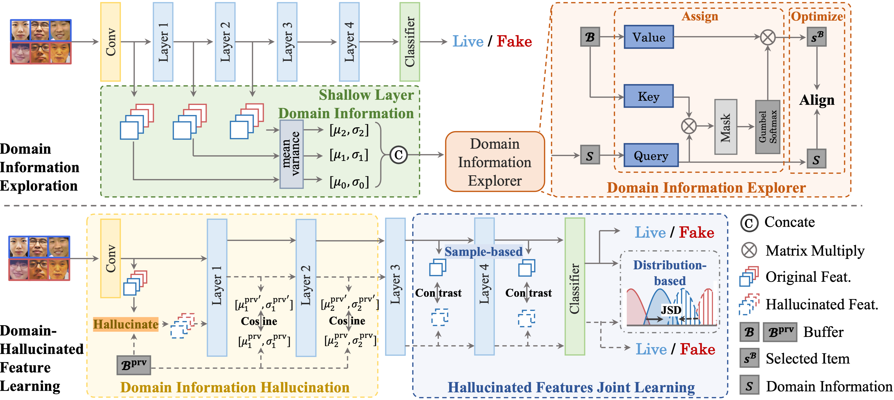

<h3 align="center">Domain-Hallucinated Updating for Multi-Domain Face Anti-spoofing</h3>

  <p align="center">
    Chengyang Hu*, Ke-Yue Zhang*, Taiping Yao, Shice Liu, Shouhong Ding, Xin Tan, Lizhuang Ma
    <br />
    <a><strong>(AAAI 2024)</strong></a>
    <br />
    <br />
    <a href="https://ojs.aaai.org/index.php/AAAI/article/view/27992">Paper</a>
    ·
    <a href="https://github.com/github_username/repo_name/issues/new?labels=bug&template=bug-report---.md">Code</a>
    ·
    <a href="https://github.com/github_username/repo_name/issues/new?labels=enhancement&template=feature-request---.md">Project Page</a>
  </p>
</div>


<!-- ABOUT THE PROJECT -->

## 💡 About The Project

This is the PyTorch implementation of our paper:

Domain-Hallucinated Updating for Multi-Domain Face Anti-spoofing

Chengyang Hu*, Ke-Yue Zhang*, Taiping Yao, Shice Liu, Shouhong Ding, Xin Tan, Lizhuang Ma.

The 38th Annual AAAI Conference on Artificial Intelligence (AAAI-24)



### Abstract

Multi-Domain Face Anti-Spoofing (MD-FAS) is a practical setting that aims to update models on new domains using only novel data while ensuring that the knowledge acquired from previous domains is not forgotten. Prior methods utilize the responses from models to represent the previous domain knowledge or map the different domains into separated feature spaces to prevent forgetting. However, due to domain gaps, the responses of new data are not as accurate as those of previous data.  Also, without the supervision of previous data, separated feature spaces might be destroyed by new domains while updating, leading to catastrophic forgetting. Inspired by the challenges posed by the lack of previous data, we solve this issue from a new standpoint that generates hallucinated previous data for updating FAS model. To this end, we propose a novel Domain-Hallucinated Updating (DHU) framework to facilitate the hallucination of data. Specifically, Domain Information Explorer learns representative domain information of the previous domains. Then, Domain Information Hallucination module transfers the new domain data to pseudo-previous domain ones. Moreover, Hallucinated Features Joint Learning module is proposed to asymmetrically align the new and pseudo-previous data for real samples via dual levels to learn more generalized features, promoting the results on all domains. Our experimental results and visualizations demonstrate that the proposed method outperforms state-of-the-art competitors in terms of effectiveness.


<!-- GETTING STARTED -->

## 🔧 Installation

We highly recommoned to build our project with `Python >= 3.10` and `Pytorch >= 1.10`.

* We recommend you to use Anaconda to create a conda environment:
  ```shell
  conda create -n DHU python=3.10
  conda activate DHU
  ```
* Install the required packages:
  ```shell
  pip install -r requirements.txt
  ```


<!-- USAGE EXAMPLES -->
## 🎇 Data Preparation

We test our model on two benchmarks including the FASMD benchmark and Long Sequence Benchmark on OCMI benchmark.

### FASMD Benchmark

1. Download datasets: [OULU-NPU](https://sites.google.com/site/oulunpudatabase/), [SIW](http://cvlab.cse.msu.edu/siw-spoof-in-the-wild-database.html), and [SiW-Mv2](https://arxiv.org/pdf/1904.02860.pdf).
2. Sample the images from the video. We recommand to sample 20 frames for every video.
3. Preprocess all sampled frames with the only face region.
4. Generate the data partition list. You can find the data split in [this refrence](https://github.com/CHELSEA234/Multi-domain-learning-FAS/tree/main/source_multi_domain/FASMD).

### OCMI Benchmark

1. To run the long sequence task, you should prepare the Dataset incluing [OULU-NPU](https://ieeexplore.ieee.org/document/7961798), [CASIA-FASD](http://www.cbsr.ia.ac.cn/users/jjyan/ZHANG-ICB2012.pdf), [Idiap Replay-Attack](http://publications.idiap.ch/downloads/papers/2012/Chingovska_IEEEBIOSIG2012_2012.pdf), [MSU-MFSD](http://biometrics.cse.msu.edu/Publications/Face/WenHanJain_FaceSpoofDetection_TIFS15.pdf).
2. Sample the images from the video. We recommand to sample 20 frames for every video.
3. Preprocess all sampled frames with the only face region.
4. Preprocess the data as the instruction of Domain Generalization Setting.


<!-- ROADMAP -->
## 🏃 Usage

### Training

To train with the FASMD task, please run the following code:
```sh
CUDA=$1
sequence=$2
tasks=$3
CUDA_VISIBLE_DEVICES=${CUDA} python3 utils/main.py --model dhu --backbone resnet-our --interval_test_epoch 100 --dataset seq-fas-task --seq ${sequence} --ntask ${tasks} --batch_size 16 --lr 1e-3 --n_epochs 1000 --buffer_size 200
```


To train with the long sequence task, please run the following code:
```sh
CUDA=$1
sequence=$2
tasks=$3
CUDA_VISIBLE_DEVICES=${CUDA} python3 utils/main.py --model dhu --backbone resnet-our --interval_test_epoch 100 --dataset seq-fas-task-ocim --seq ${sequence} --ntask ${tasks} --batch_size 16 --lr 1e-3 --n_epochs 1000 --buffer_size 200
```

Here is the explaination of the parameters:
* `CUDA` : GPU ID, for example `0,1` for 2 GPUs;
* `sequence`: Training sequence;
  * In FASMD benchmark, you should defined training sequence as `A,B`, `A,C`, `A,D` and `A,E`;
  * In OCMI benchmark, you should defined training sequence as `C,O,I,M`
* `tasks`: Number of the tasks, `2` for FASMD and `4` for OCMI;
* `model`: Model name;
* `backbone`: Encode backbone name;
* `interval_test_epoch`: Interval epoch for test;
* `dataset`: Dataset name;
* `batch_size`: Batchsize for training;
* `lr`: Learning rate;
* `n_epochs`: Training epoch for every task;
* `buffer_size`: The size of the stored domain information.

You can also check the project [mammoth](https://github.com/aimagelab/mammoth) for the meaning of different training parameters.


<!-- CONTRIBUTING -->
## 😊 Citing Our Work

If you find our work is useful in your reasearch, please consider citing:
```bib
@inproceedings{hu2024domain,
  title={Domain-Hallucinated Updating for Multi-Domain Face Anti-spoofing},
  author={Hu, Chengyang and Zhang, Ke-Yue and Yao, Taiping and Liu, Shice and Ding, Shouhong and Tan, Xin and Ma, Lizhuang},
  booktitle={Proceedings of the AAAI Conference on Artificial Intelligence},
  volume={38},
  number={3},
  pages={2193--2201},
  year={2024}
}
```


<!-- ACKNOWLEDGMENTS -->
## 🙏 Acknowledgments
Our work is based on the following opensource project。 We thank their authors for making the source code publically available.
* [mammoth](https://github.com/aimagelab/mammoth)
* [Multi-domain Learning FAS](https://github.com/CHELSEA234/Multi-domain-learning-FAS/tree/main/source_SiW_Mv2)

